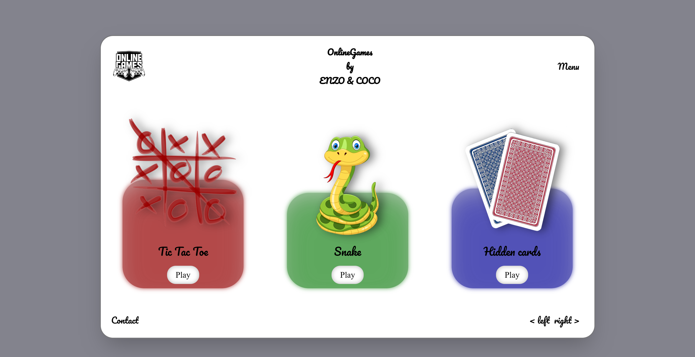
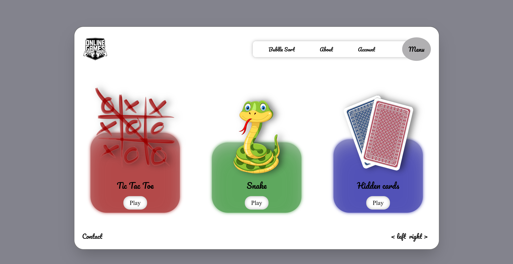
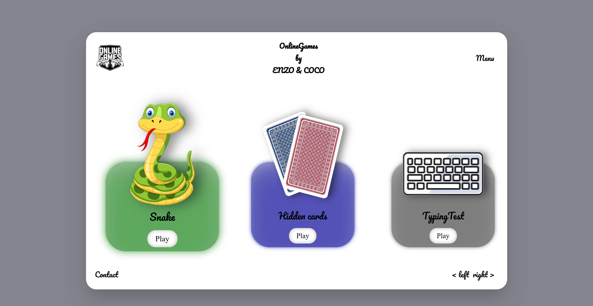
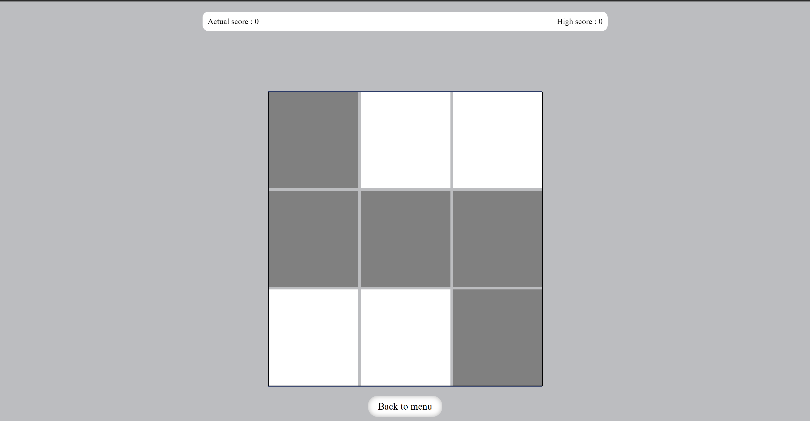

# Welcome on my Java Script Project, hope you'll enjoy my work

## Description

Here, i'm glad to present you my Java script Project coded in java script of course, and with a bit of html and css.

In this project, you can fin a web hub of some small games like snake, tic tac toe and more

## Installation

Attention !! Windows Defender don't like Getlinks.js file. Take care you can install it with defender on, else, turn it off

We recomend you to have vs code installed on your computer (https://code.visualstudio.com).

After installing vs code, install Node.js from web browser to be able to update API, and add extension Live Server on your IDE, You'll need it to launch the web page.

Node.js : https://nodejs.org/en
Live Server: https://marketplace.visualstudio.com/items?itemName=ritwickdey.LiveServer

## Languages

FR/ENG
Contributing
This was coded by BEDO Corentin and MARTINEZ Enzo !

## Contact

Coco - Discord : Cooco - corentin.bedo@ynov.com
Enzo - Discord : Enzo - enzo.martinez@ynov.com

## Pictures of final version

Page

Page with opened menu

Other games

Snake game

Hidden cards game

